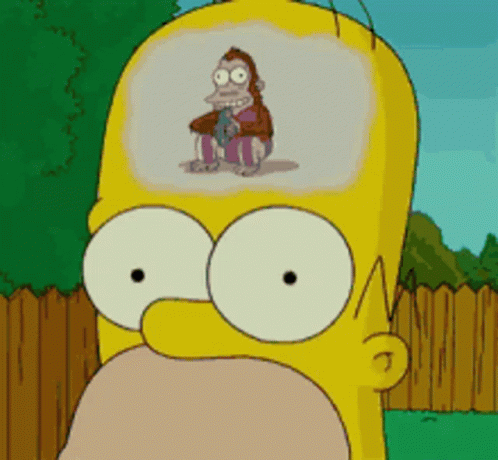

# THIRSTY VAMPIRE

LibGDX is a Java game development framework. This project was created to dip my toes into it and have some fun. Right now, everything is based on [this tutorial from the official docs](https://libgdx.com/wiki/start/a-simple-game)

My idea is that the final game will be an improvement of that demo with scores, progression, challenges (like holy water vs blood falling from the sky) and some animations.

I shouldn't be spending time on things like that, so probably I will not work on it right now. This project is the result of my difficulty focusing on important things.

